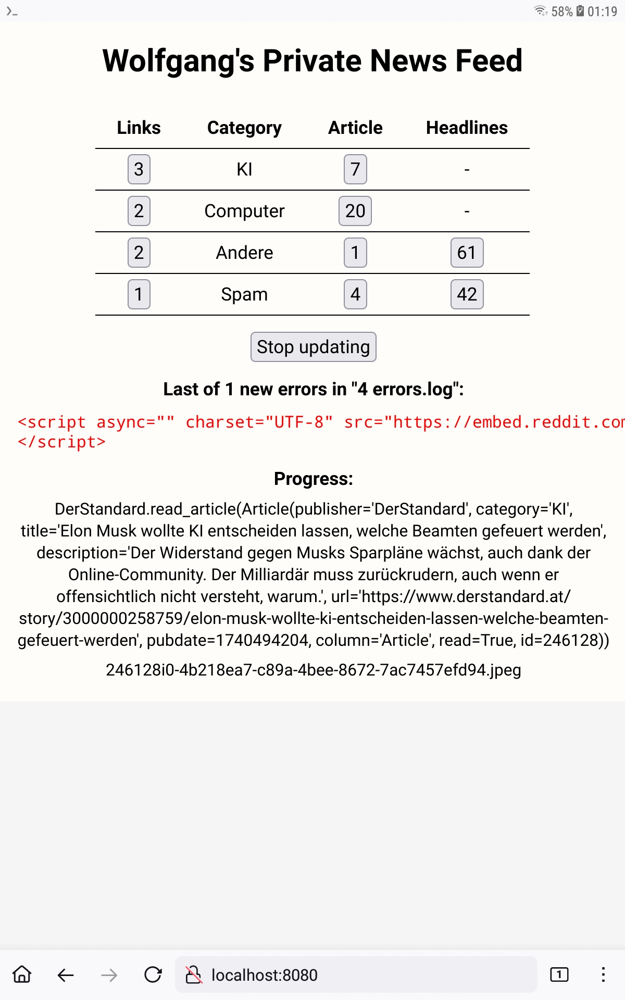

# Wolfgang's Private News Feed

Lizenz ist CC0. Geschrieben in Python und ein bisschen HTML/CSS/JavaScript. Läuft bei mir hauptsächlich auf dem Android Galaxy Tablet A SM-T580 von 2016 mit 2 GB RAM und 16 GB Flash unter Termux. QPython 3L ginge ebenfalls, weil man da schneller Programme starten kann als zwischen ACode und Termux hin und her zu schalten. Für die Entwicklung auf dem Desktop verwende ich Linux Mint, das ist besser geeignet als ein Tablet, weil da Tastatur und Maus dranhängen. Synchronisiert werden die beiden mit SyncThing. Man muss allerdings darauf achten, dass _News.py_ auf dem Tablet vorher mit _Ctrl+C_ beendet wird, sonst werden die Veränderungen, die man in der Datenbank _3 News.db_ auf dem Desktop macht, später auf Android wieder überschrieben. Und das im Hintergrund laufende SyncThing wird von Android manchmal rausgeschmissen, ich glaube das passiert dann, wenn Android neu bootet.

Es wird nur ein Minimum an externen Libraries benötigt, nämlich Beautiful Soup (bs4) für das Scrapen aus dem Netz, Bottle als Webserver und deep_translator für das Übersetzen der englischsprachigen Headlines nach Deutsch. Die Artikel selber werden mit Google Web Translate über das Verändern der URL übersetzt, falls das möglich ist, bei TechCrunch zum Beispiel funktioniert Google Web Translate nicht. Bei QPython 3L ist Bottle bereits vorinstalliert, von bs4 muss man dort leider eine 5 Jahre alte Version manuell installieren, weil das QPython nur die veraltete Version 3.6 ist.

Wenn News.py läuft, kann man es vom Browser aus unter _localhost:8080_ erreichen. Dort auf _[Update]_ klicken, und er fängt an, sich die neuesten Nachrichten aus dem Netz zu laden. Während er lädt, kann man im Vordergrund in der Spalte _Links_ schon lesen:

Die beiden Spalten rechts sind offline. Er lädt sich also die Artikel und Headlines aus dem Netz und speichert sie lokal als Dateien ab. So kann man später unterwegs lesen, wenn man keine billige WiFi-Verbindung hat. Es geht auch schneller, der Sprung von einem Artikel zum nächsten dauert ungefähr eine Sekunde, dann ist der Artikel inklusive Aufmacherbild geladen und angezeigt.

In der Spalte _Headlines_ kann man Artikel ignorieren, zum Lesen vormerken oder bei bestimmten Wortmustern blockieren:

Die Headlines werden dann beim nächsten Update-Pass heruntergeladen, ganz so wie man das früher in den 1990er Jahren bei CompuServe gemacht hat.
